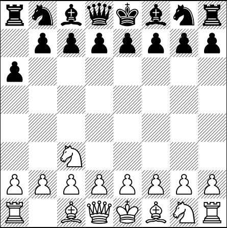

This was an experiment where I had a chess game running via github actions with the resulting chessboard being shown in a LaTeX image format, the game history was stored in a csv file containing every move that was made

# LaTeX Chess

